# Socket Server

Lab 5 for computer networks

## 文件说明

- package.h: 自定义协议中相关常量及数据包的定义
- package.cpp: package.h中定义的操作的具体实现
- server.h: 服务端头文件
- server.cpp: 服务端实现

## 协议说明

### 宏定义

`package.h`中定义了服务器端口号和最大缓冲区长度两个值。

### 类型定义

#### 客户端连接状态

包含未连接和已连接两种状态。

```cpp
enum class ConnectStatus {
	DISCONNECTED, CONNECTED
};
```

#### 数据包类型

包含非法、时间、字符串、客户端列表和转发五种类型。

```cpp
enum class PackageType {
	INVALID, TIME, STRING, CLIENTS, FORWARD
};
```

#### 客户端信息

包含客户端索引、连接状态、套接字、地址和端口五种信息。

在客户端请求获取所有客户端信息时，服务端会将`vector<Client>`序列化后发送给客户端。

注意：在发送的数据包中不含`socket`信息，即反序列化后的`vector<Client> *`指针指向的内容中`socket`信息为`INVALID_SOCKET`。

```cpp
typedef struct {
	int index;
	ConnectStatus status;
	SOCKET socket;
	std::string addr;
	int port;
} Client;
```

#### 转发请求包

包含转发目标客户端索引、发送者序号、地址、端口号和转发内容，其中转发内容为序列化后的数据包。

发送者**无需**提供自己的地址和端口号，服务端会自动获取。

```cpp
typedef struct {
	int to;
	int from;
	std::string sender_addr;
	int sender_port;
	char *data;
} ForwardRequest;
```

### 数据包

客户端与服务端之间传输的数据包字符流内容如下：



数据内容和字符流之间的转换（即序列化和反序列化）由Package类实现。

针对时间、字符串、客户端列表和转发四种数据包，序列化重载实现了以下转换：

- `time_t` <=> `char *`
- `char *`(C格式字符串) <=> `char *`
- `vector<Client>` <=> `char *`
- `ForwardRequest` <=> `char *`

反序列化实现了从`char *`到相应类型的***指针***之间的转换

#### 序列化

以`Forward`数据包为例：

```cpp
ForwardRequest request; // 需要发送的内容
// ... set request
char data[MAXBUFLEN];   // 存储序列化后的数据用于发送
// serialize参数说明请见package.h，第四个参数为data缓冲区最大长度，默认值为MAXBUFLEN
int len = Package::serialize(PackageType::FORWARD, &request, data); // 返回值为序列化后的长度
int ret = send(socket, data, len, 0);   // 使用winsock2中函数发送数据，socket为目标套接字
// ... error handling
```

#### 反序列化

以`Forward`数据包为例：

```cpp
// 接收到数据存储于data中（类型为char *）
void *field;
Package::deserialize(PackageType::FORWARD, field, data);
ForwardRequest request = *(ForwardRequest *) field;
// ... use request
```

### 连接过程

客户端发起连接请求后，服务端会发送字符串"Hello from server!\0"，代表连接开始。

客户端可发送以下请求：

|   请求内容    |           类型           |       内容       |
|:---------:|:----------------------:|:--------------:|
|   获取时间    | `PackageType::STRING`  |     "date"     |
| 获取服务器主机名  | `PackageType::STRING`  |   "hostname"   |
| 获取所有客户端信息 | `PackageType::STRING`  | "client-list"  |
|   转发消息    | `PackageType::FORWARD` | ForwardRequest |

除此以外其余请求信息均为非法，服务端将返回相应错误字符串(`Package::STRING`)。

## TODO

- [x] package.h/cpp
    - [x] 数据结构设计
    - [x] 数据的序列化与反序列化
    - [x] 序列化时的缓冲区溢出检查
    - [x] 反序列化时的格式正确性检查
- [ ] server.h/cpp
    - [x] 服务端初始化与端口绑定
    - [x] 服务端主线程监听，循环accept
    - [x] 服务端子线程处理请求
    - [ ] 服务端子线程之间共享资源的互斥访问